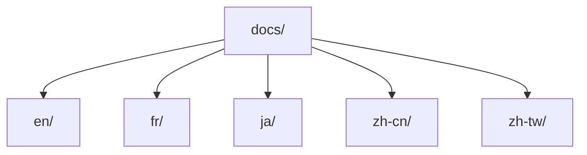
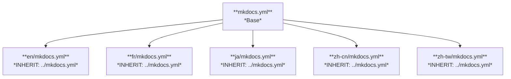
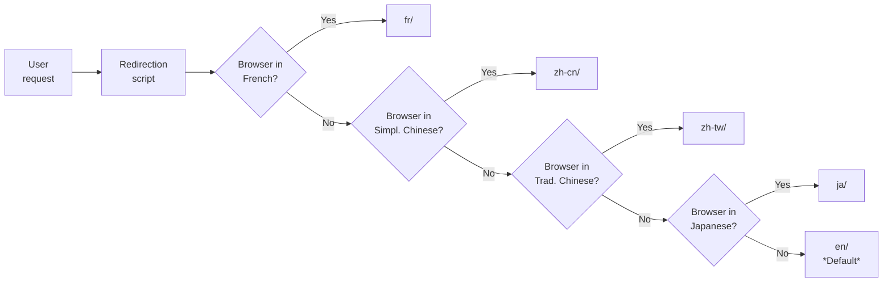
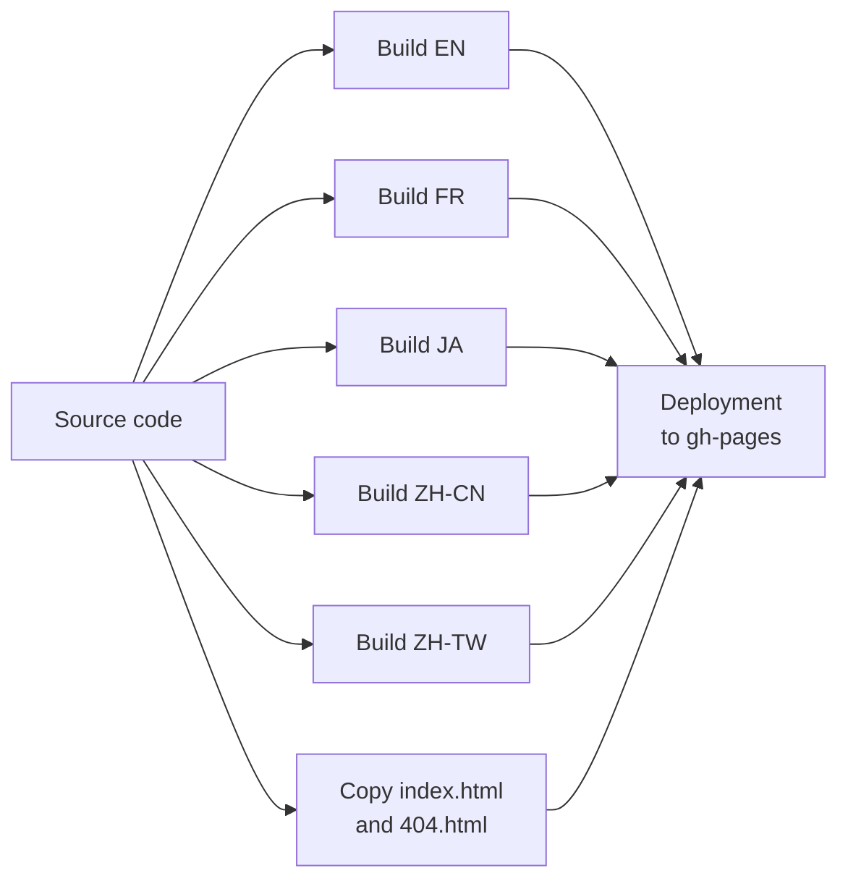

This document presents the conceptual model used to organise and publish multilingual content on the *Technical Margins* blog.

The objective is to explain the technical choices behind the site's architecture and to show how this model provides a coherent experience to readers, regardless of their language.



This blog uses a pragmatic approach with separate folders by language (`en`, `fr`, `ja`, `zh-cn`, `zh-tw`), each with its own configuration inheriting from a common base. A browser language-based redirection script guides users. This model prioritises simplicity, maintenance and independent evolution of content by language.



## Introduction: Why a multilingual model?

On a personal blog like *Technical Margins*, multilingual publishing isn't limited to translating texts. It requires organising content, ensuring smooth navigation and maintaining the site efficiently over time.

For this project, the objective is to:

- Offer versions in French, English, Chinese and Japanese.
- Allow each language to evolve at its own pace.
- Maintain a simple and robust architecture that's easy to manage alone.

**Why not use a plugin like [i18n](https://ultrabug.github.io/mkdocs-static-i18n/)?** Simply because it's not compatible with the `blog` plugin of Material for MkDocs. Additionally, by creating my own system, I can experiment with alternative approaches to multilingual content management rather than relying on a pre-packaged solution.  

Is it really problematic not to be able to automatically switch from one language version of an article to another? Probably not: the majority of readers will read in a single language, and it remains possible to manually change `/en/`, `/fr/`, etc. in the URL.

## The challenges of multilingualism

Setting up a multilingual site raises several key questions:

- How to organise content in files?
- How to guarantee a good user experience across languages?
- How to facilitate maintenance and updates?
- What technical solution to implement to manage everything?

## Possible models

There are two classic approaches:

- **Single source model:** everything is written first in a primary language, then translated into others.
- **Parallel model:** each language evolves independently, sometimes with different content.

For *Technical Margins*, I've chosen an approach between the two: most articles are translated between languages, but some versions may be prioritised for writing or updating, and the content isn't always strictly identical. This allows adaptation to the context of each language while maintaining a common base.

On the technical side, there weren't many alternatives: currently, the `i18n` plugin doesn't work with the blog function of Material for MkDocs. Changing tools would have moved the project away from its main objective: experimenting with MkDocs and GitHub. This solution ultimately proved simple and effective for a personal blog.

## File organisation

Content is separated by language in the file structure:

```
docs/
├── en/
├── fr/
├── ja/
├── zh-cn/
└── zh-tw/
```

I chose this structure to keep things simple and pragmatic: each language has its own folder, which makes the organisation very readable, even when I work alone or return to the project after several weeks.

**Why this structure works well:**

- **Clear responsibilities:** I always know where to find and store a file for a given language.
- **Independent evolution:** I can publish an article in French before translating it into English, or vice versa, without blocking the rest.
- **Ease of translation:** I work on complete files by language, which avoids managing scattered fragments.
- **Resilience:** if an article hasn't yet been translated into Japanese, the site continues to function normally for other languages.
- **Simplicity of navigation:** even manually, I can change language in the URL (`/fr/`, `/en/`) without getting lost or confused about where I am in the site structure.

This approach also prevents me from being locked into a system that's too rigid, and allows me to adapt content if needed, language by language.



## Configuration organisation

MkDocs configurations are separate but inherit from a common base:

```
config/
├── mkdocs.yml        # Common base
├── en/
│   └── mkdocs.yml
├── fr/
│   └── mkdocs.yml
├── ja/
│   └── mkdocs.yml
├── zh-cn/
│   └── mkdocs.yml
└── zh-tw/
    └── mkdocs.yml
```

I chose this organisation to guarantee both general coherence and local flexibility.

**In practice:**

- The main parameters (theme, plugins) are defined only once in the base file.  
- Each language can adjust certain elements, such as the site footer or its metadata, without affecting the rest.  
- This approach limits duplication, reduces the risk of errors and ensures coherent evolution of the site.  



**Local limitation:**

This organisation does, however, have an important consequence: locally, I can only serve one language at a time (e.g. `mkdocs serve -f config/en/mkdocs.yml`). If I want to visualise the entire multilingual site as in production, I need to create a dedicated [Docker image](../guide/) that simulates the complete environment.

## Language detection and redirection

To automatically direct users to the right language, a simple `index.html` script at the root detects the browser's language.

I chose this method because it was the simplest to implement, even if it's not the most sophisticated.

The script works like this:

- It detects which language your browser is set to.
- It checks if there is content in that language.
- If your language isn't available, it shows you the English version instead.



## Generation and deployment

With the multilingual structure and redirection in place, the next step is generating and publishing the site. For this, I use a GitHub Actions pipeline, which automates the building and deployment of different languages on GitHub Pages.

**How it works:**

The pipeline triggers automatically whenever changes are pushed to the `main` branch. The process follows these steps:

1. **Environment preparation:**  
    - The system clones the repository.  
    - It installs Python 3.12 and all necessary dependencies (`mkdocs-material`, `mkdocs-glightbox`, etc.).

2. **Language building:**  
    - The pipeline builds each language separately, running `mkdocs build` for `en`, `fr`, `ja`,, `zh-cn` and `zh-tw` with their respective configuration files.

3. **Global page management:**  
    - The process includes copying the `index.html` and `404.html` files that handle language redirection and error pages.

4. **Site deployment:**  
    - The final content is pushed to the `gh-pages` branch, which GitHub Pages uses to host the public site.

**Why this system is useful:**

- Each language is generated independently, which reduces risks: an error in one language doesn't prevent the deployment of others.
- Everything is automated: I don't need to manually build or deploy.

In practice, the pipeline is parallelised to speed up generation by building all language versions simultaneously.

**Visual overview:**



## Conclusion: A balanced and evolving model

I chose this multilingual model primarily to experiment. It allows me to test MkDocs beyond simple technical documentation while familiarising myself with GitHub.

Even if this approach doesn't allow automatically switching from one language version to another, it remains suitable for a personal blog, where readers generally consult in just one language. And for those who want to compare, it's always possible to change the language in the URL.

It's a simple, sustainable and scalable approach that allows me to continue learning while evolving *Technical Margins*.
