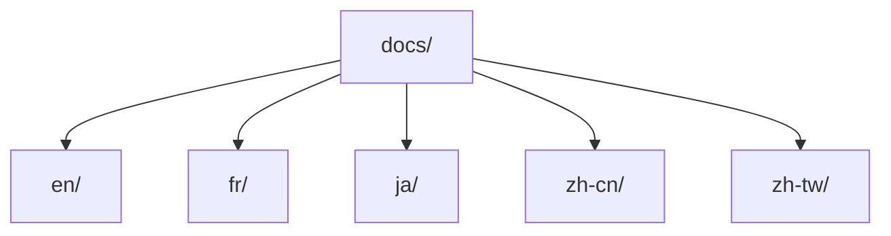
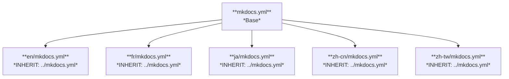
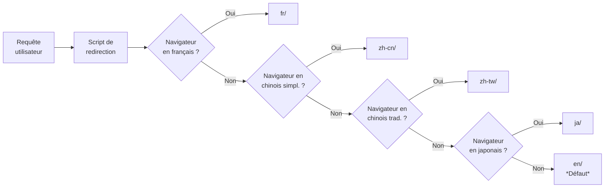
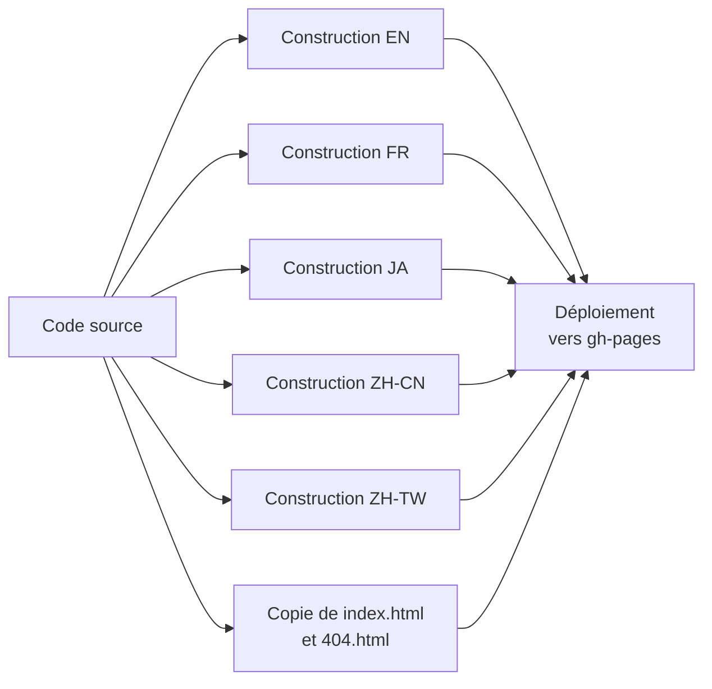

Ce document présente le modèle conceptuel utilisé pour organiser et publier le contenu multilingue sur le blog *Technical Margins*.

L'objectif est d'expliquer les choix techniques derrière l'architecture du site et de montrer comment ce modèle permet de proposer une expérience cohérente aux lecteurs, quelle que soit leur langue.



Ce blog utilise une approche pragmatique avec des dossiers séparés par langue (`en`, `fr`, `ja`, `zh-cn`, `zh-tw`), chacun ayant sa propre configuration héritant d'une base commune. Un script de redirection basé sur la langue du navigateur guide les utilisateurs. Ce modèle privilégie la simplicité, la maintenance et l'évolution indépendante des contenus par langue.



## Introduction : Pourquoi un modèle multilingue ?

Sur un blog personnel comme *Technical Margins*, la publication multilingue ne se limite pas à traduire les textes. Il faut organiser les contenus, assurer une navigation fluide et maintenir efficacement le site au fil du temps.

Pour ce projet, l'objectif est de :

- Proposer des versions en français, anglais, chinois et japonais.
- Permettre à chaque langue d'évoluer à son propre rythme.
- Garder une architecture simple et robuste, facile à gérer seule.

**Pourquoi ne pas avoir utilisé un plugin comme [i18n](https://ultrabug.github.io/mkdocs-static-i18n/) ?** Simplement parce qu'il n'est pas compatible avec la fonction blog de Material for MkDocs. De plus, cela permet d'expérimenter un modèle différent, sans dépendre d'un outil tout-en-un.

Est-ce vraiment gênant de ne pas pouvoir passer automatiquement d'une version linguistique à l'autre d'un même article ? Probablement pas : la majorité des lecteurs liront dans une seule langue, et il reste possible de changer manuellement `/fr/`, `/en/`, etc. dans l'URL.

## Les défis du multilingue

La mise en place d'un site multilingue soulève plusieurs questions clés :

- Comment organiser les contenus dans les fichiers ?
- Comment garantir une bonne expérience utilisateur entre les langues ?
- Comment faciliter la maintenance et les mises à jour ?
- Quelle solution technique mettre en place pour gérer l'ensemble ?

## Modèles possibles

Il existe deux approches classiques :

- **Modèle source unique :** on écrit tout d'abord dans une langue principale, puis on traduit dans les autres.
- **Modèle parallèle :** chaque langue évolue de façon indépendante, avec parfois des contenus différents.

Pour *Technical Margins*, j'ai choisi une approche entre les deux : la plupart des articles sont traduits entre les langues, mais certaines versions peuvent être écrites ou mises à jour en priorité, et le contenu n'est pas toujours strictement identique. Cela permet de s'adapter au contexte de chaque langue, tout en gardant une base commune.

Sur le plan technique, il n'y avait pas beaucoup d'alternatives : actuellement, le plugin `i18n` ne fonctionne pas avec la fonction blog de Material for MkDocs. Changer d'outil aurait éloigné le projet de son objectif principal : expérimenter avec MkDocs et GitHub. Cette solution s'est finalement révélée simple et efficace pour un blog personnel.

## Organisation des fichiers

Les contenus sont séparés par langue dans l'arborescence des fichiers :

```
docs/
├── en/
├── fr/
├── ja/
├── zh-cn/
└── zh-tw/
```

J'ai choisi cette structure pour rester simple et pragmatique : chaque langue a son propre dossier, ce qui rend l'organisation très lisible, même quand je travaille seule ou que je reviens sur le projet après plusieurs semaines.

**Pourquoi cette structure fonctionne bien :**

- **Responsabilités claires :** je sais toujours où trouver et où ranger un fichier pour une langue donnée.
- **Évolutions indépendantes :** je peux publier un article en français avant de l'avoir traduit en anglais, ou inversement, sans bloquer le reste.
- **Facilité pour les traductions :** je travaille sur des fichiers complets par langue, ce qui évite de gérer des fragments dispersés.
- **Résilience :** si un article n'est pas encore traduit en japonais, le site continue à fonctionner normalement pour les autres langues.
- **Simplicité de navigation :** même à la main, je peux changer de langue dans l'URL (`/fr/`, `/en/`) sans perdre mes repères.

Cette approche m'évite aussi de m'enfermer dans un système trop rigide, et me permet d'adapter les contenus si besoin, langue par langue.



## Organisation des configurations

Les configurations MkDocs sont séparées, mais héritent d'une base commune :

```
config/
├── mkdocs.yml        # Base commune
├── en/
│   └── mkdocs.yml
├── fr/
│   └── mkdocs.yml
├── ja/
│   └── mkdocs.yml
├── zh-cn/
│   └── mkdocs.yml
└── zh-tw/
    └── mkdocs.yml
```

J'ai choisi cette organisation pour garantir à la fois une cohérence générale et une flexibilité locale.

**En pratique :**

- Les paramètres principaux (thème, plugins) sont définis une seule fois dans le fichier de base.  
- Chaque langue peut ajuster certains éléments, comme le pied de page du site ou ses métadonnées, sans toucher au reste.  
- Cette approche limite les duplications, réduit les risques d'erreurs et assure une évolution cohérente du site.  



**Limite en local :**

Cette organisation a toutefois une conséquence importante : en local, je ne peux servir qu'une langue à la fois (`mkdocs serve -f config/fr/mkdocs.yml` par exemple). Si je veux visualiser l'ensemble du site multilingue comme en production, je dois créer une [image Docker](../guide/) dédiée qui simule l'environnement complet.

## Détection de la langue et redirection

Pour diriger automatiquement l'utilisateur vers la bonne langue, un simple script `index.html` à la racine détecte la langue du navigateur.

J'ai choisi cette méthode parce que c'était la plus simple à mettre en place, même si ce n'est pas la plus sophistiquée.

Le script vérifie :

- La langue préférée du navigateur.
- La correspondance avec les langues disponibles.
- Le fallback sur l'anglais en cas de besoin.



## Génération et déploiement

Une fois la structure multilingue et la redirection mises en place, il faut générer et publier le site. Pour cela, j'utilise un pipeline GitHub Actions, qui automatise la construction et le déploiement des différentes langues sur GitHub Pages.

**Comment ça fonctionne :**

Le pipeline est déclenché à chaque push sur la branche `main`. Voici ce qu'il fait, étape par étape :

1. **Préparation de l'environnement :**  
    - Il clone le dépôt.
    - Il installe Python 3.12 et les dépendances nécessaires (`mkdocs-material`, `mkdocs-glightbox`, etc.).

2. **Construction de chaque langue :**  
    - Il exécute `mkdocs build` séparément pour `en`, `fr`, `ja`, `zh-cn` et `zh-tw` avec les bons fichiers de configuration.

3. **Gestion des pages globales :**  
    - Il copie les fichiers `index.html` et `404.html` pour gérer la redirection et les erreurs.

4. **Déploiement du site :**  
    - Il pousse le contenu final sur la branche `gh-pages`, utilisée par GitHub Pages pour l'hébergement public.

**Pourquoi ce système est utile :**

- Chaque langue est générée indépendamment, ce qui réduit les risques : une erreur dans une langue n'empêche pas le déploiement des autres.
- Tout est automatisé : je n'ai pas besoin de construire ni de déployer manuellement.

En pratique, le pipeline est parallélisé afin d’accélérer la génération en construisant toutes les versions linguistiques simultanément.

**Aperçu visuel :**  



## Conclusion : Un modèle équilibré et évolutif

J'ai choisi ce modèle multilingue avant tout pour expérimenter. Cela me permet de tester MkDocs au-delà d'une simple documentation technique, tout en me familiarisant avec GitHub.

Même si cette approche ne permet pas de basculer automatiquement d'une version linguistique à l'autre, elle reste adaptée à un blog personnel, où les lecteurs consultent en général une seule langue. Et pour qui voudra comparer, il reste toujours possible de changer la langue dans l'URL.

C'est une approche simple, durable et évolutive, qui me permet de continuer à apprendre tout en faisant évoluer *Technical Margins*.
